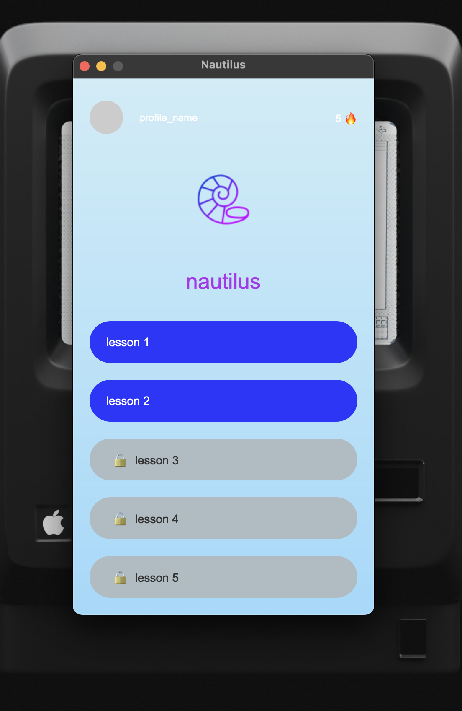
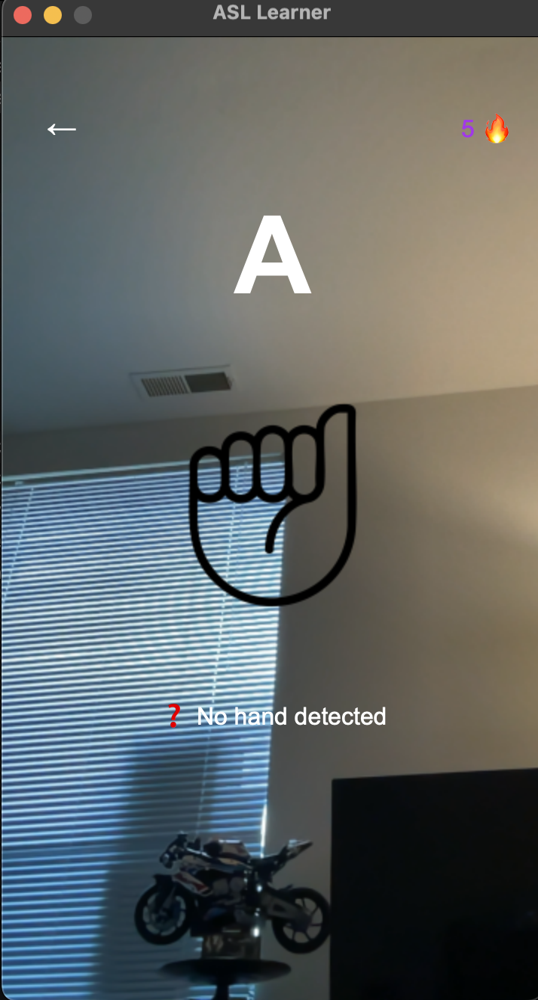

# ASL Learner App
Using AI models to teach ASL symbols

## Design 

  
  

## Setup

### Installing the Correct Python Version
The AI Model for this app using Tensorflow and Mediapipe. Because Mediapipe only works for a selected version of python, **this project will use Python Version 3.8.10**. Instead of uninstalling the user's current version of python and downgrading it, we will add the correct version into the project itself.

### About Each Directory and File

- `App/` - Contains all files protaining to the App.
  - `AI Model/` - Holds all files for the hand recognition AI Model
    - `asl_model.h5` - Holds the AI Model
    - `collectData.py` - Run this script to collect the data needed to train the model.
    - `trainModel.py` - Uses the data produced by `collectData.py` and outputs the `.h5` AI Model code.
  - `HandRecognizer.py` - A class used to recognize hand signals and return appropriate data.
  
- `Documentation/` - Holds all documentation information about the project, including Documents overviewing the structure of the app.

----------
## Classes

### HandRecognizer

The `HandRecognizer` class preforms operations with the AI model to detct and return what symbols are being presented to the camara

- Location: HandRecognizer.py

#### Attributes:
- This class has no public attributes

#### Methods:
- `openCamara() -> None`
Turns on the camara for the AI Model to view.

- `closeCamara() -> None`
Turns off the camara.

- `getCurrentHandSymbol() -> str | None`
Opens the camara if it is not opened already and views what symbol the user is making with their hands. If no *hand* is found, `None` is returned. Otherwise, the symbol detected is returned.

- `waitUntilHandSymbol(symbol: str) -> str`
Blocks the script until the specified symbol is detected. The method then returns the specified symbol. Be careful in that if the symbol is not something the model was trained on, then the scripted will be blocked forever. There may be a time where we add a timeout functionality to it.

----------
